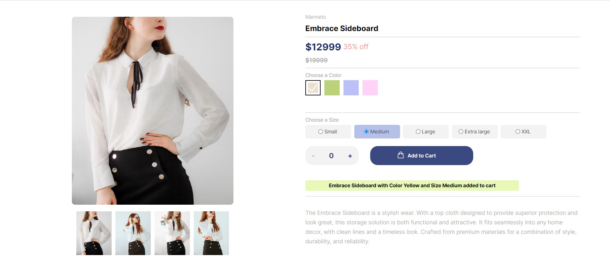

# Product List Page



This project is a simple Product List Page created using HTML, CSS, and JavaScript. It displays a list of products with their details, such as name, vendor, price, and description. The page also includes functionalities such as selecting a color and size for each product, adding the product to the cart, and displaying a message when the product is added to the cart.

## Table of Contents

- [Features](#features)
- [Technologies Used](#technologies-used)
- [Workflow](#workflow)
- [Getting Started](#getting-started)
- [Usage](#usage)
- [Contributing](#contributing)
- [License](#license)

## Features

- Display a list of products with their details
- Select a color and size for each product
- Add the product to the cart
- Display a message when the product is added to the cart

## Technologies Used

- HTML
- CSS
- JavaScript

## Workflow

1. Created the HTML structure for the product list page
2. Designed the CSS styles for the page
3. Implemented the JavaScript functionalities for selecting a color and size, adding the product to the cart, and displaying a message
4. Tested the page on different screen sizes using media queries

## Getting Started

To get a local copy up and running, follow these simple steps:

1. Clone the repository

    ```bash
    git clone https://github.com/rachitst/Marmeto-Product-Page.git
    ```

2. Navigate to the project directory

    ```bash
    cd Marmeto-Product-Page
    ```

3. Open the `index.html` file in a web browser

## Usage

The product list page displays a list of products with their details. To select a color and size for a product, click on the desired color and size options. To add the product to the cart, click on the "Add to Cart" button. A message will be displayed when the product is added to the cart.

## Contributing

Contributions are welcome! Follow these steps:

1. Fork the Project
2. Create your Feature Branch (git checkout -b feature/AmazingFeature)
3. Commit your Changes (git commit -m 'Add some AmazingFeature')
4. Push to the Branch (git push origin feature/AmazingFeature)
5. Open a Pull Request

## License

Distributed under the MIT License. See [LICENSE](LICENSE) for more information.

## Contact

Rachit Chheda - rachitchheda16@gamil.com

Project Link: [https://github.com/rachitst/Marmeto-Product-Page](https://github.com/rachitst/Marmeto-Product-Page)
